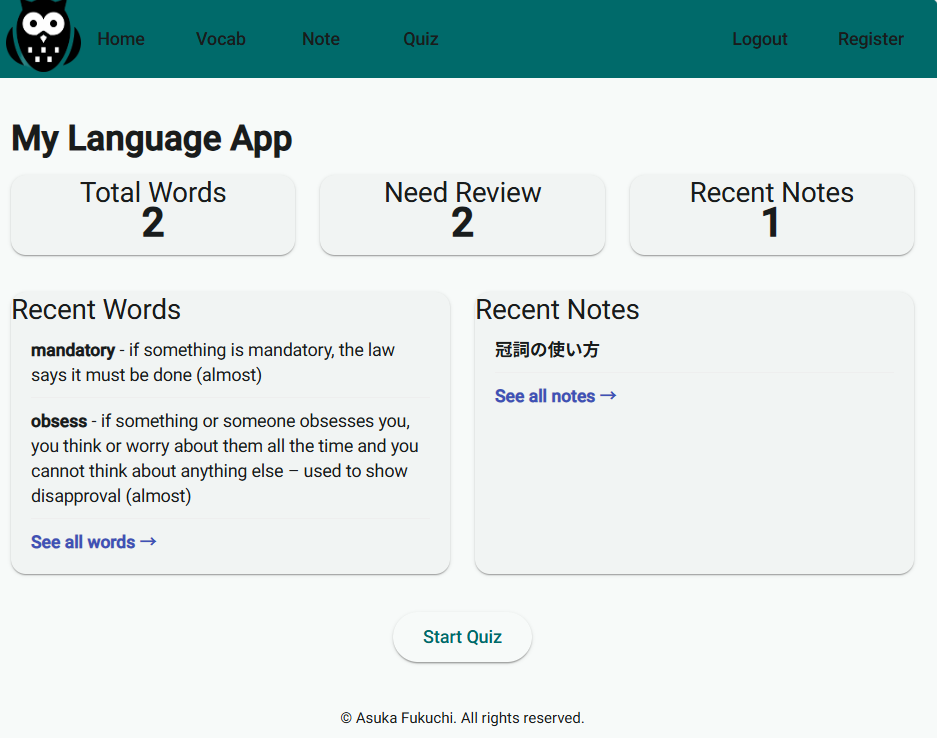
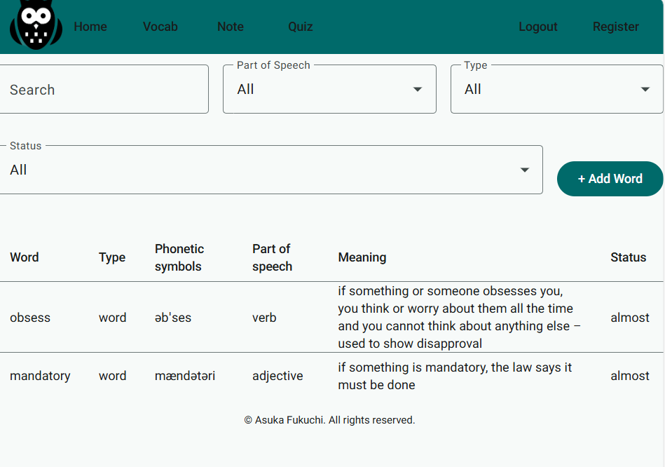
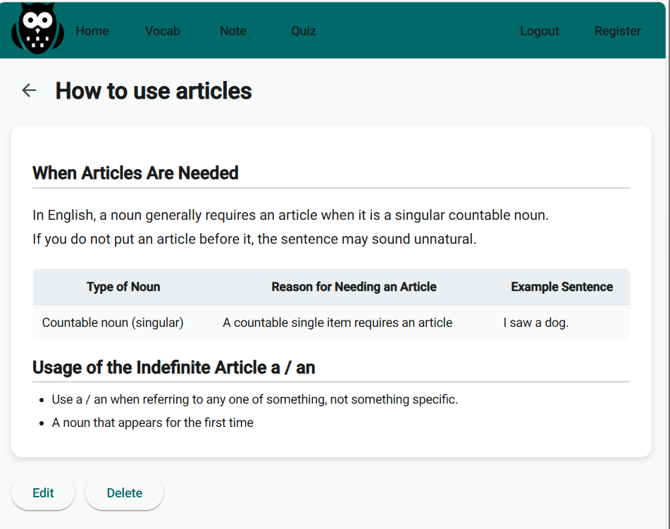

# Language Learning App

## About
My Language App is a language learning support application.
It allows you to manage words and phrases, create notes, take quizzes, and track your progress with a dashboard.

The frontend is built with Angular + Material, and the backend uses Node.js + Express + MongoDB.
While it is designed for language learners, it can also be adapted for other learning purposes.

---

## Development Background

Although I have used many learning apps in the past, I could not find one that met my ideal requirements, so I decided to build my own.

---

## Skills
<strong>Frontend:</strong> Angular, Angular Material, TypeScript, HTML, CSS  
<strong>Backend:</strong> Node.js, Express, MongoDB (Mongoose)

---

## Features
- Add, edit, and delete words
- Spaced repetition quizzes (based on the forgetting curve)
- Note creation and block editing (paragraphs, lists, tables, images)
- User registration, login, and logout
- Dashboard to track progress for words and notes

---

## Screenshots




---

## Project Structure
```bush
language-learning-app/
├── backend/
│   ├── db/                # Database connection
│   │   └── connect.ts
│   ├── middleware/        # Authentication, etc.
│   │   └── auth.ts
│   ├── models/            # Mongoose models
│   │   ├── user.model.ts
│   │   ├── word.model.ts
│   │   └── note.model.ts
│   ├── routes/            # API routes
│   │   ├── user.routes.ts
│   │   ├── word.routes.ts
│   │   ├── note.routes.ts
│   │   └── dashboard.routes.ts
│   ├── .env               # Environment variables
│   └── server.ts          # Entry point
├── frontend/
│   ├── public/
│   ├── src/
│       ├── app/
│           ├── components/       # Footer, Header, Notes, etc.
│           ├── core/             # Interceptors
│           │   └── auth.interceptor.ts
│           ├── material/         # Material module
│           │   └── material-module.ts
│           ├── pages/            # auth/, home/, notes/, quiz/, words/
│           └── services/         # auth, home, note, quiz, user, word
```

---

## How to run
1. Clone this repository
```bush 
git clone https://github.com/your-username/language-learning-app.git
cd language-learning-app
```

2. Install dependencies
```bush 
# Frontend
cd frontend && npm install
# Backend
cd ../backend && npm install
cd ..
```

3. Set environment variables
```bush 
MONGO_URI=your_mongodb_connection_string
PORT=3000
JWT_SECRET=your_secret_key
```

4. Start the development server
```bush 
npm run dev
```

---

## Future Improvements
- Allow users to create custom word lists for focused study
- Expand quiz formats (multiple choice, input, flip, time-limited)
- Add pronunciation verification
- Display news articles or other sources to expose users to new words